## Overview

[Firebase](https://firebase.google.com/) is Google's all-encompassing app development platform, providing game developers with an array of backend tools powered by Google Cloud.

Within Unity, we've integrated the Firebase SDK to facilitate backend functionalities. Coupled with the [Google Play Games plugin for Unity](https://github.com/playgameservices/play-games-plugin-for-unity), it ensures a secure and efficient login for Android users.

The integration is further enhanced with the [Openfort Firebase extension](https://extensions.dev/extensions/openfort/firestore-openfort-transactions), which incorporates the [Openfort SDK](https://github.com/openfort-xyz/openfort-node). This enables Unity clients to directly leverage Openfort's blockchain capabilities, allowing for sophisticated blockchain interactions within the gaming environment.

## Application Workflow

//TODO

## Prerequisites

//TODO Google Play and Google cloud account and project?

### Clone or download the repository and open it with Unity [2021.3](https://unity.com/releases/editor/qa/lts-releases?version=2021.3).
  When opening the project, select ***Ignore*** on this popup:

  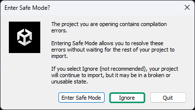

  Once opened, you will see some reference errors. We will solve this in the next step by importing the Firebase SDK.

### Follow the [Firebase-Unity setup guide](https://firebase.google.com/docs/unity/setup?hl=es-419).
  On [step 4](https://firebase.google.com/docs/unity/setup?hl=es-419#add-sdks), you just need to import ***FirebaseAuth*** and ***FirebaseFirestore*** packages:

  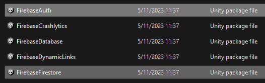

  Do it one by one and disable ***ExternalDependencyManager*** folder before importing:

  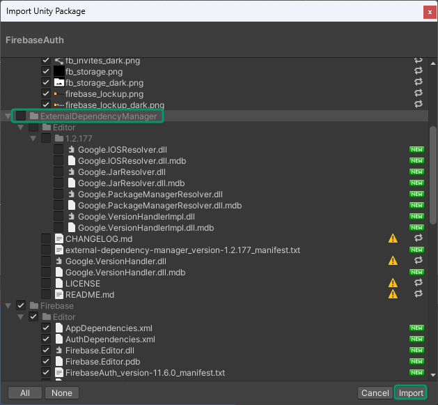

  Most reference errors should be solved by now. If `UnityEditor.iOS.Extensions.Xcode` error is still standing, select ***Firebase.Editor*** asset, disable ***Validate References*** and choose ***Apply***:

  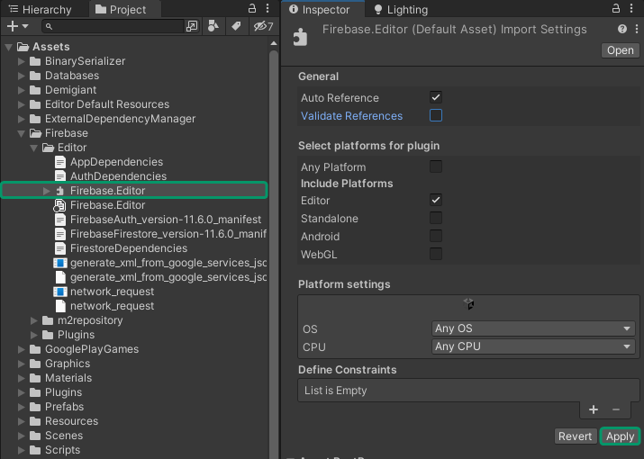

## Set up Firebase

### Add Google sign-in provider

Go to the [Firebase console](https://console.firebase.google.com/?hl=es-419), select your project and select ***Authentication***:

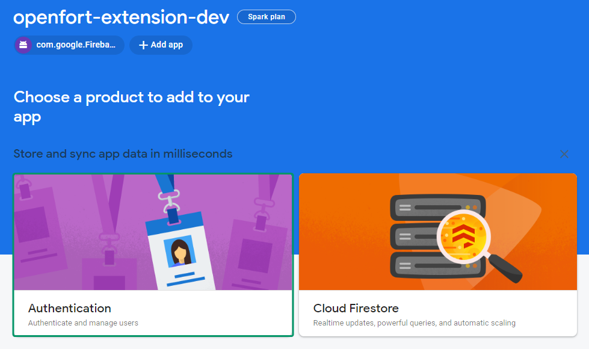

Select ***Get started***:

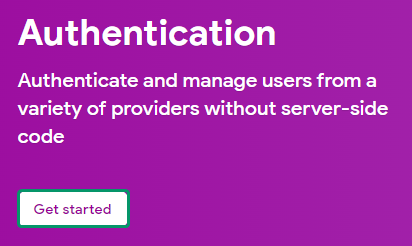

Select ***Google*** as a sign-in provider:

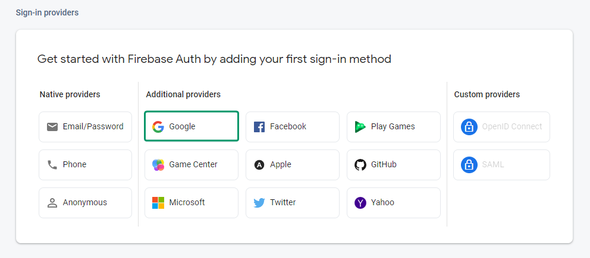

Activate ***Enable*** toggle, choose a public-facing name and select ***Save***:

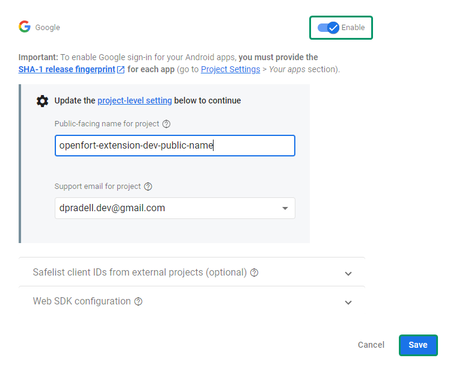

A popup will appear. Copy the ***Web client ID*** and the ***Web client secret*** somewhere safe and choose ***Done***. You will see your Google provider enabled. Go ahead and choose ***Add new provider***:

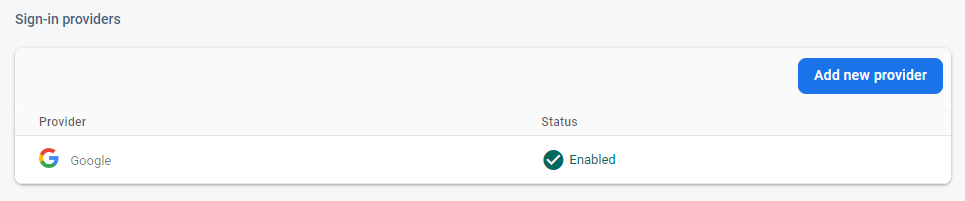

### Add Google Play sign-in provider

Select ***Google Play*** as a sign-in provider:

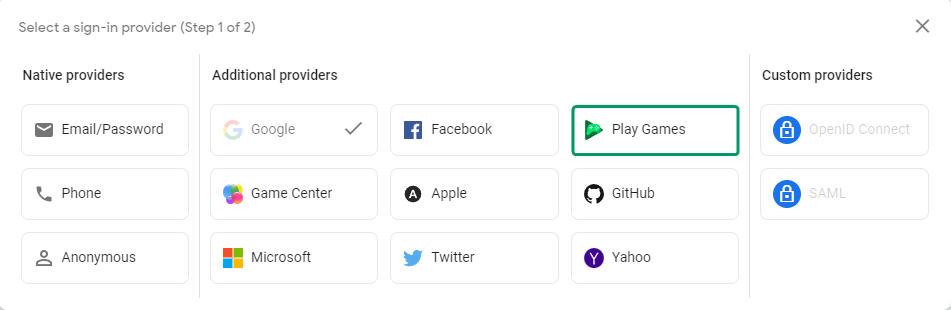

Activate ***Enable*** toggle, enter the credentials you just saved and choose ***Save***:

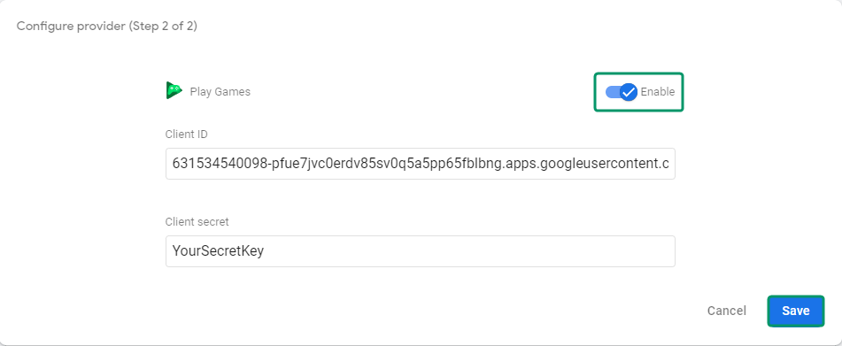

Both ***Google*** and ***Google Play*** sign-in providers are ready:

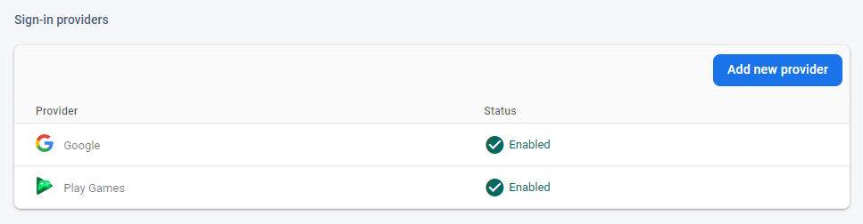

## Set up Google Play

> **Reminder:** Use the same Google account you used for setting up your Firebase app.

### Create a new app
Go to [Play Console](https://play.google.com/console) and create a new app. Enter app details (it's important you select ***Game***), confirm policies and select ***Create app***:

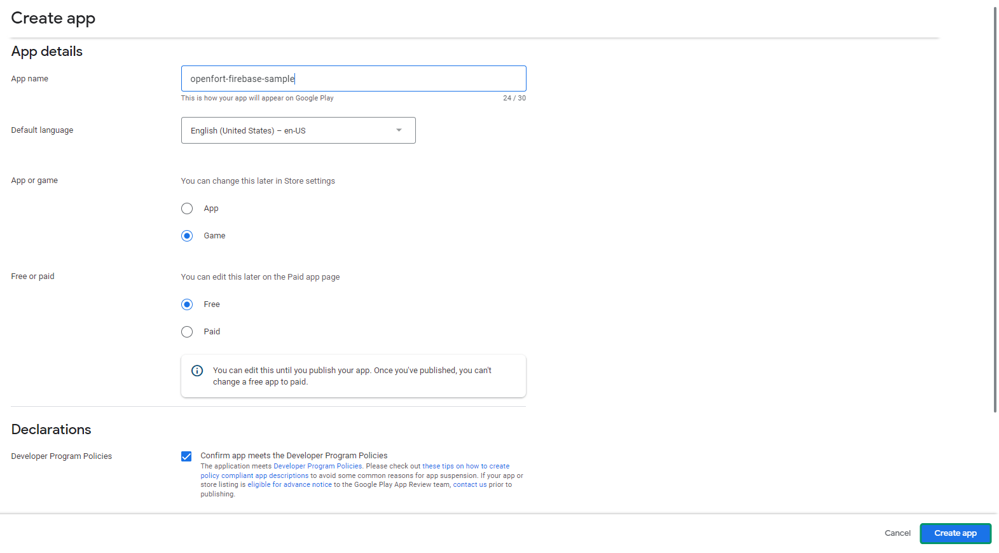

Under ***Grow --> Play Games Services --> Setup and management --> Configuration***, select ***Create new Play Games Services project*** and choose your Firebase project as a cloud project. Then select ***Use***:

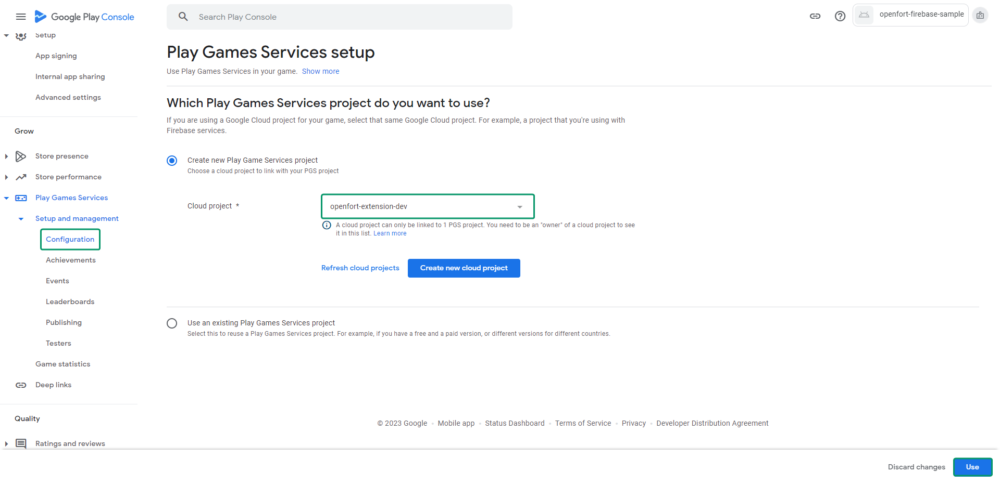

### Add credentials

Under ***Credentials*** section choose ***Add credential***:

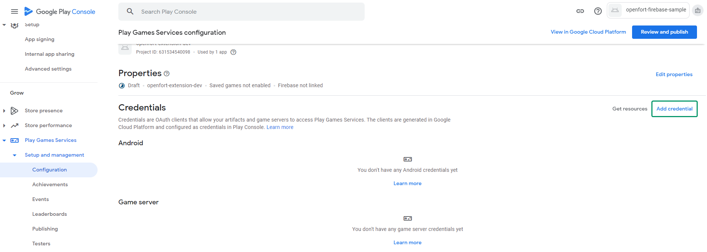

Select ***Android***:

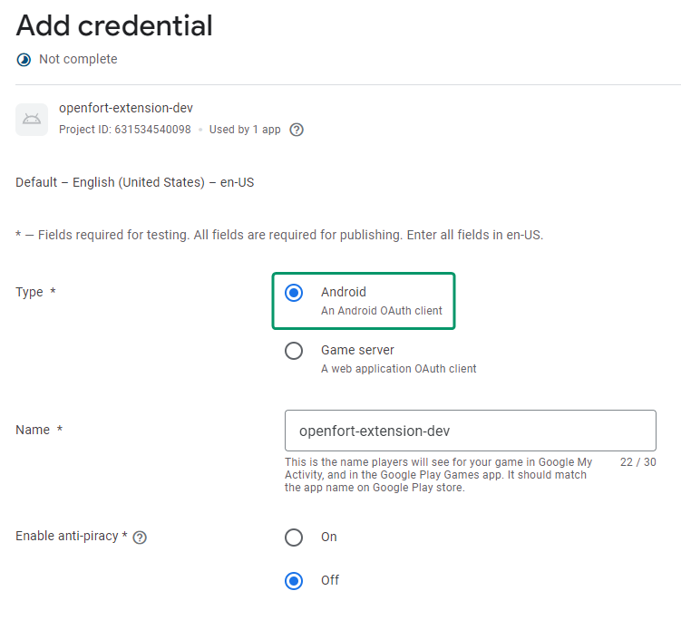

Scroll down and select ***Create OAuth client***:

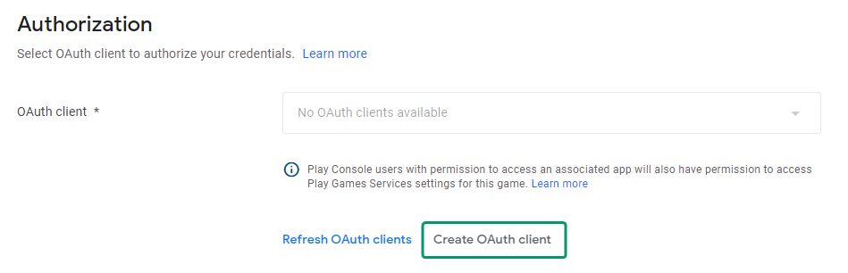

Choose ***Create OAuth Client ID***:

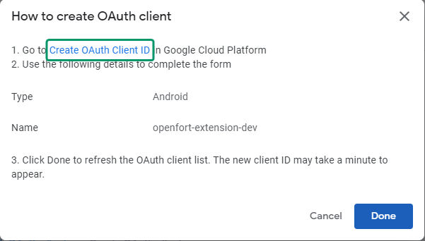

This will open the Google Cloud console. Now select ***Android*** as *Application type*, enter a *Name* and fill the *Package name* with the Unity app package name (found in the Android Platform Player Settings):

## Test in Editor

## Test on Android

Upon building and running the game on an Android device, the registration/login process is automated via Google Play Games, resulting in a streamlined user experience.

## Conclusion

Upon completing the above steps, your Unity game will be fully integrated with Openfort and Firebase. Always remember to test every feature before deploying to guarantee a flawless player experience.

For a deeper understanding of the underlying processes, check out the [tutorial video](//TODO). 

## Get support
If you found a bug or want to suggest a new [feature/use case/sample], please [file an issue](../../issues).

If you have questions, comments, or need help with code, we're here to help:
- on Twitter at https://twitter.com/openfortxyz
- on Discord: https://discord.com/invite/t7x7hwkJF4
- by email: support+youtube@openfort.xyz