## Overview

[Firebase](https://firebase.google.com/) is Google's all-encompassing app development platform, providing game developers with an array of backend tools powered by Google Cloud.

Within Unity, we've integrated the Firebase SDK to facilitate backend functionalities. Coupled with the [Google Play Games plugin for Unity](https://github.com/playgameservices/play-games-plugin-for-unity), it ensures a secure and efficient login for Android users.

The integration is further enhanced with the [Openfort Firebase extension](https://extensions.dev/extensions/openfort/firestore-openfort-transactions), which incorporates the [Openfort SDK](https://github.com/openfort-xyz/openfort-node). This enables Unity clients to directly leverage Openfort's blockchain capabilities, allowing for sophisticated blockchain interactions within the gaming environment.

## Application Workflow

//TODO

## Prerequisites

- ### Sign in to [dashboard.openfort.xyz](http://dashboard.openfort.xyz) and create a new project.
- ### You need a [Google Play Developer account](https://support.google.com/googleplay/android-developer/answer/6112435?hl=en).
- ### You need a [Google Cloud project](https://developers.google.com/workspace/guides/create-project).
- ### Clone or download the repository and open it with Unity [2021.3](https://unity.com/releases/editor/qa/lts-releases?version=2021.3).
  When opening the project, select ***Ignore*** on this popup:

  

  Once opened, you will see some reference errors. We will solve this in the next step by importing the Firebase SDK.
- ### Follow the [Firebase-Unity setup guide](https://firebase.google.com/docs/unity/setup?hl=es-419).
  On [step 4](https://firebase.google.com/docs/unity/setup?hl=es-419#add-sdks), you just need to import ***FirebaseAuth*** and ***FirebaseFirestore*** packages:

  

  Do it one by one and disable ***ExternalDependencyManager*** folder before importing:

  

  Most reference errors should be solved by now. If `UnityEditor.iOS.Extensions.Xcode` error is still standing, select ***Firebase.Editor*** asset, disable ***Validate References*** and choose ***Apply***:

  
- ### Create a keystore
  Follow this [guide](https://docs.unity3d.com/Manual/android-keystore-create.html) to create a new keystore for the Unity project.
- ### Find SHA1 certificate fingerprint
  You need to extract the certificate fingerprint from the created keystore. Follow this [video tutorial](https://www.youtube.com/watch?v=lDXE4lfM0aQ) on how to do it, it also covers the creation of the keystore.

## Set up Firebase

### Add Google sign-in provider

Go to the [Firebase console](https://console.firebase.google.com/?hl=es-419), select your project and select ***Authentication***:

Select ***Get started***:

Select ***Google*** as a sign-in provider:

Activate ***Enable*** toggle, choose a public-facing name and select ***Save***:

A popup will appear. Copy the ***Web client ID*** and the ***Web client secret*** somewhere safe and choose ***Done***. You will see your Google provider enabled:

Select the provider and choose ***Project Settings***. Under ***Your apps*** section select ***Add fingerprint*** and add your [SHA1 certificate fingerprint](https://github.com/openfort-xyz/firebase-extension-unity-sample/tree/main#find-sha1-certificate-fingerprint). Then choose ***Save***:

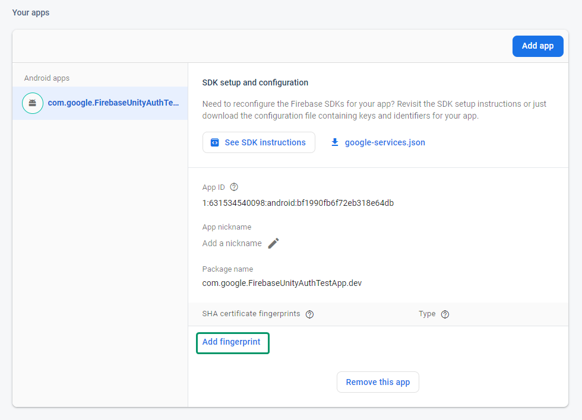

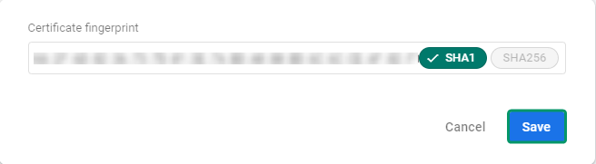

### Add Google Play sign-in provider

Select ***Add new provider*** and choose ***Google Play***:

Activate ***Enable*** toggle, enter the credentials you just saved and choose ***Save***:

Both ***Google*** and ***Google Play*** sign-in providers are ready:

### Install Openfort Extension

Go to the [Firebase Extensions Hub](https://extensions.dev/extensions/openfort/firestore-openfort-transactions) and choose ***Install in Firebase console***:

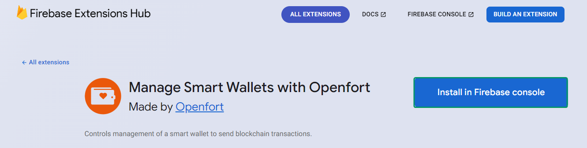

Choose your project to continue:

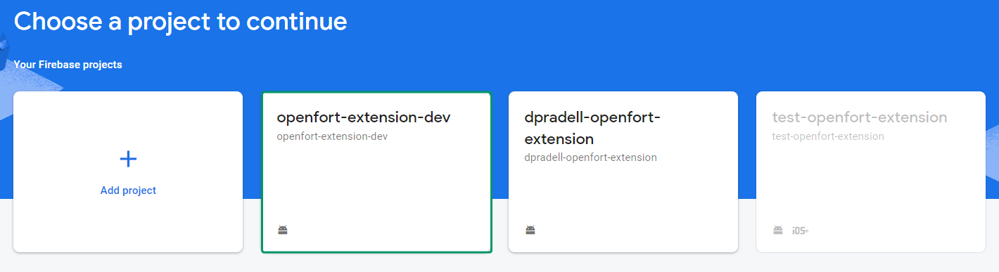 

Set up your billing profile and follow the instructions until you need to insert the [Openfort API Secret key](https://dashboard.openfort.xyz/apikeys) and choose ***Create secret***. Leave all the other settings as default:

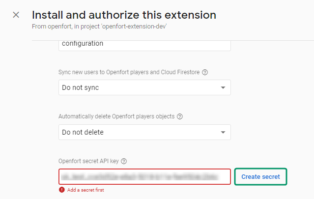

Finally choose ***Install extension***. After 3-5 minutes you will see the extension installed:

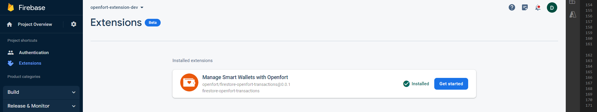

Now select ***Get started*** and under ***How this extension works*** section find ***Configure Openfort webhooks***. Copy the URL:

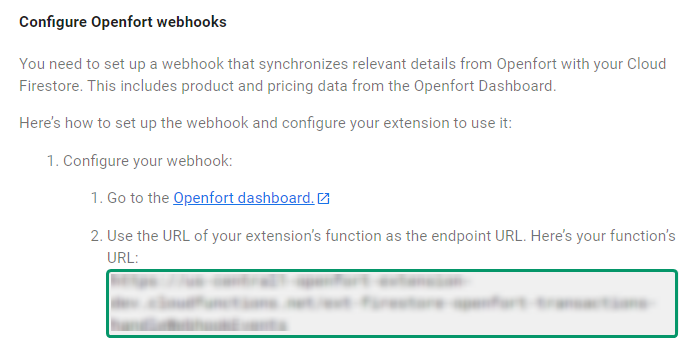

Go to the [Openfort dashboard - Webhooks](https://dashboard.openfort.xyz/webhooks) and choose ***Add webhook***:

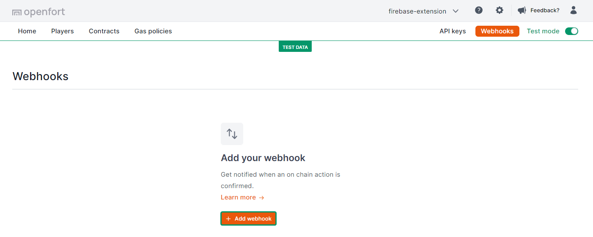

Paste the webhook URL and leave the *Type* as it is. Choose ***Add webhook***:

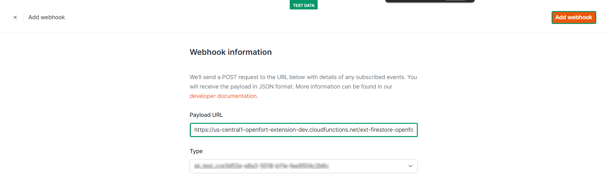

## Set up Google Play

> **Reminder:** Use the same Google account you used for setting up your Firebase app.

### Create a new app
Go to [Play Console](https://play.google.com/console) and create a new app. Enter app details (it's important you select ***Game***), confirm policies and select ***Create app***:

Under ***Grow --> Play Games Services --> Setup and management --> Configuration***, select ***Create new Play Games Services project*** and choose your Firebase project as the cloud project. Then select ***Use***:

### Add credentials

#### Add Android OAuth client credential

Under ***Credentials*** section choose ***Add credential***:

Select ***Android***:

Scroll down and select ***Create OAuth client***:

Choose ***Create OAuth Client ID***:

This will open the Google Cloud console. Now select ***Android*** as *Application type*, enter a *Name* and fill the *Package name* with the **Unity app package name** (found in the Android Platform Player Settings):

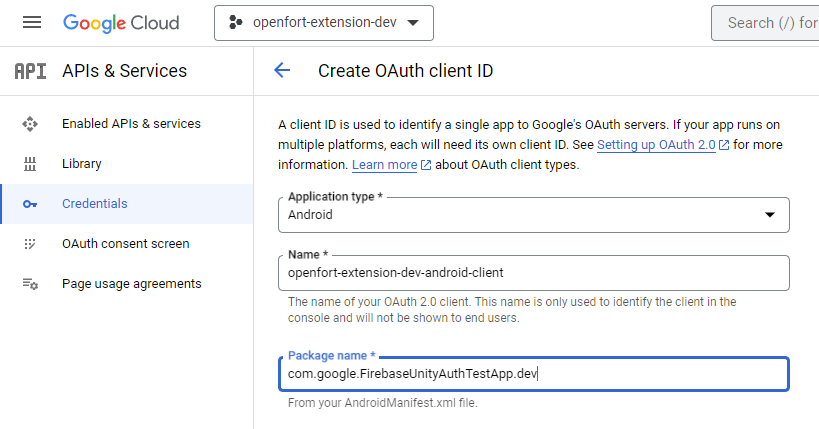

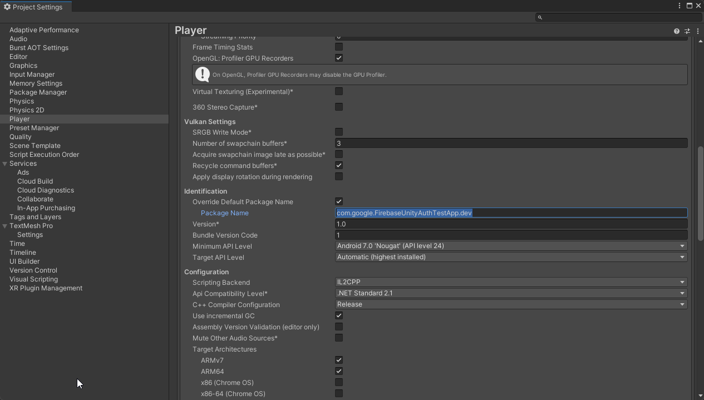

Enter your [SHA1 certificate fingerprint](https://github.com/openfort-xyz/firebase-extension-unity-sample/tree/main#find-sha1-certificate-fingerprint) and choose ***CREATE***:

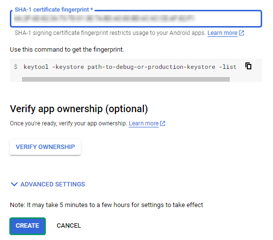

Now you can download the JSON and choose ***OK***:

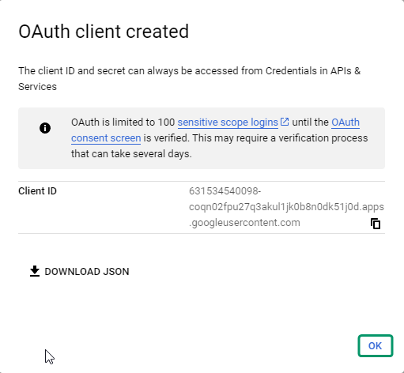

Go back to the Google Play console, select ***Done*** and choose your newly created Android OAuth client. Then select ***Save changes***:

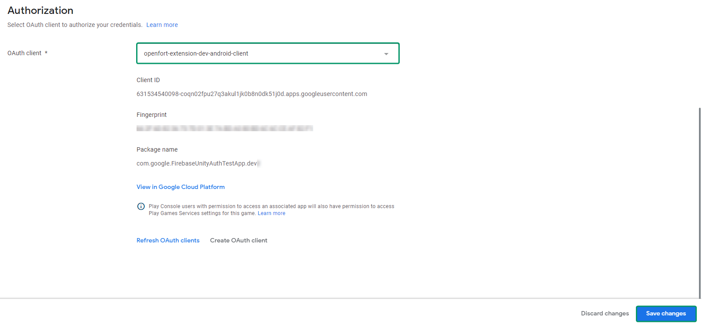

#### Add Game server/Web OAuth client credential

Go back to ***Configuration*** and select ***Add credential***:

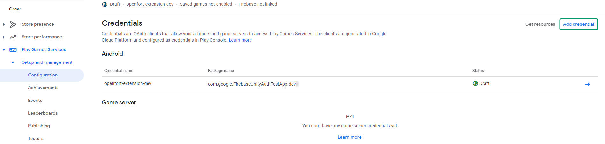

Choose ***Game server***, refresh OAuth clients, select ***Web client (auto created by Google Service)*** (it was created automatically during [this process](https://github.com/openfort-xyz/firebase-extension-unity-sample/tree/main#add-google-sign-in-provider)) and select ***Save changes***:

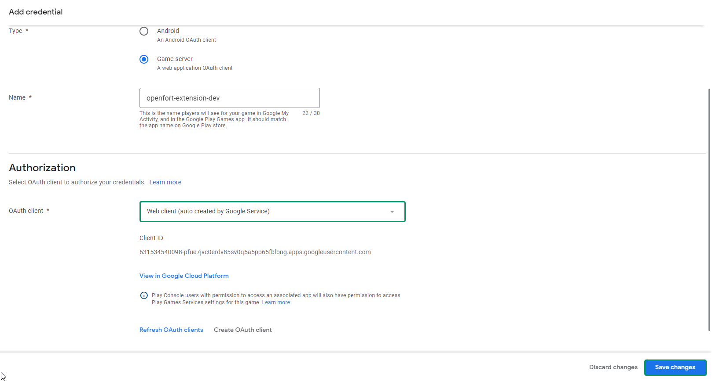

Finally copy the ***OAuth client ID***:

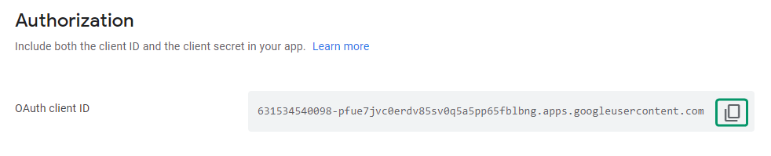

## Set up Unity project

> **Reminder:** Make sure ***Android*** is selected as a platform in ***Build settings***. 

Go to ***Window --> Google Play Games --> Setup --> Android setup***:

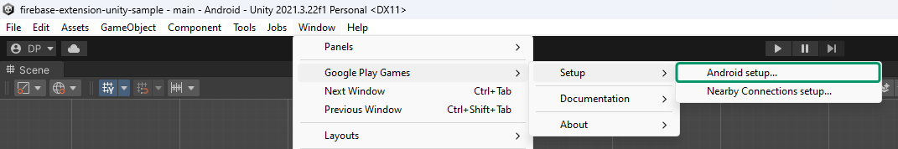

Paste the ***Game server OAuth client ID*** you just copied under ***Client ID***:

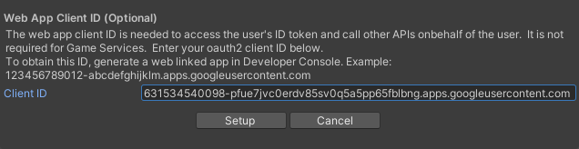

Go to the [Google Play console](https://play.google.com/console) and on your app's configuration select ***Get resources***:

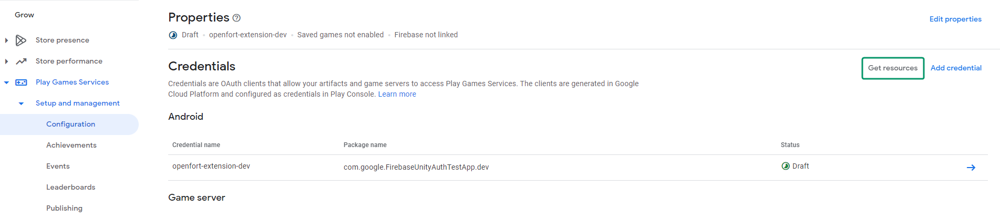

Copy the Android (XML):

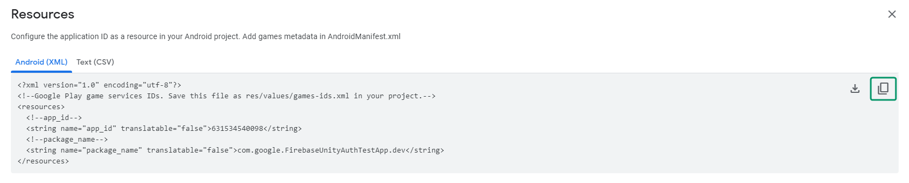

In Unity, paste it in ***Resources Definition*** and then select ***Setup***:

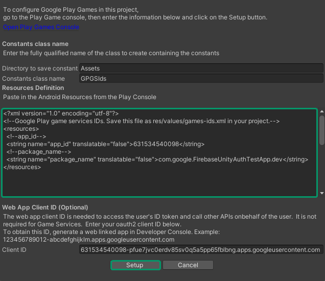

Finally, go to the [Firebase console](https://console.firebase.google.com/?hl=es-419) and under your app configuration, download the ***google-services.json***:

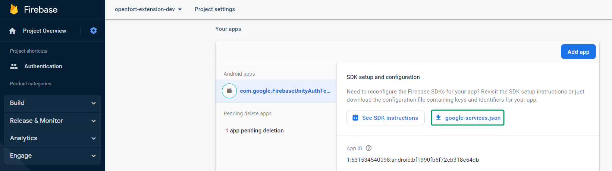

Import it in your Unity project ***Assets*** folder to make sure every credential is up to date.

## Test on Android

Upon building and running the game on an Android device, the registration/login process is automated via Google Play Games, resulting in a streamlined user experience.

## Conclusion

Upon completing the above steps, your Unity game will be fully integrated with Openfort and Firebase. Always remember to test every feature before deploying to guarantee a flawless player experience.

For a deeper understanding of the underlying processes, check out the [tutorial video](//TODO). 

## Get support
If you found a bug or want to suggest a new [feature/use case/sample], please [file an issue](../../issues).

If you have questions, comments, or need help with code, we're here to help:
- on Twitter at https://twitter.com/openfortxyz
- on Discord: https://discord.com/invite/t7x7hwkJF4
- by email: support+youtube@openfort.xyz